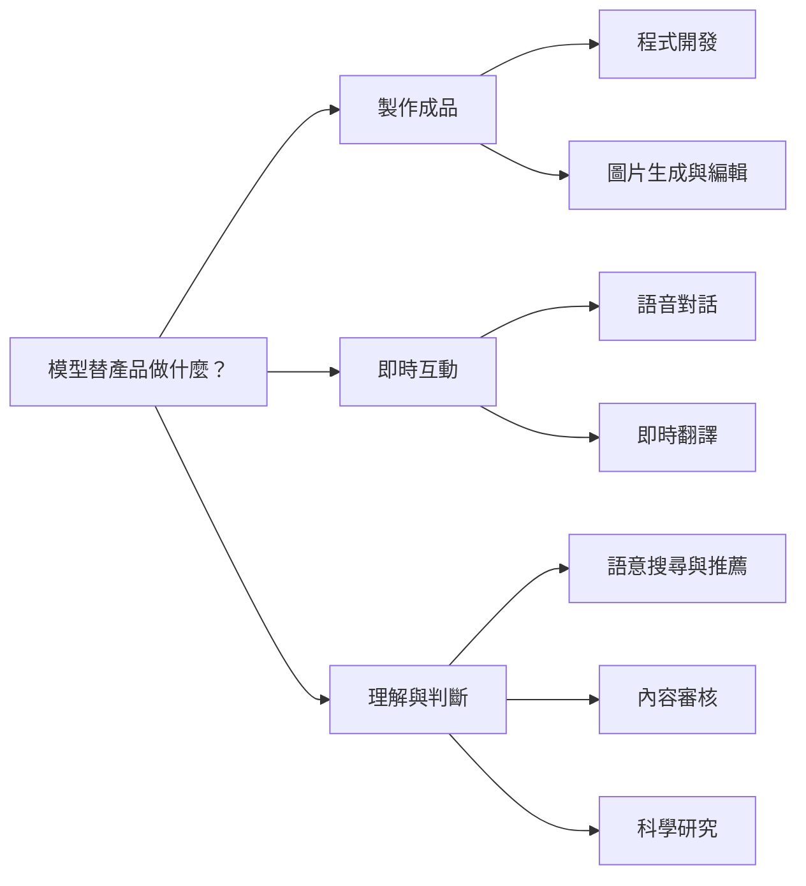
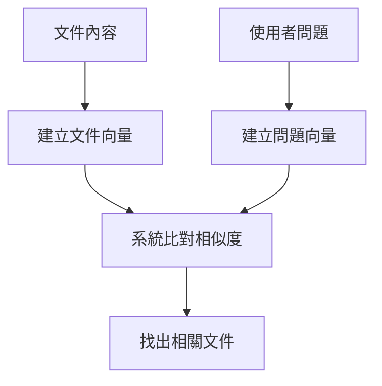

# Codex-name｜模型選單之外的 OpenAI

> [!TIP]
> **先看模型替產品做什麼，再看它叫什麼、從哪裡使用。**
> 有些模型陪你工作，有些負責畫圖或對話，也有些在背景搜尋與審核。

寫給熟悉 GPT、平常使用 Codex，卻對 Spark、Sunburst、Flare 等名字感到陌生的人。

## 先看這張 Mental Map

模型會因為**任務、輸入輸出與反應速度**的需求而分化。以下依用途整理成三條路，方便理解；這是本文的閱讀地圖，並非 OpenAI 的正式組織或完整產品線分類。



**選一條路閱讀：** [製作成品](#製作成品) · [即時互動](#即時互動) · [理解與判斷](#理解與判斷)

## 為什麼模型存在，我卻看不到？

**模型目錄列的是能力；產品選單列的是那個入口開放給你選擇的模型。**

| 使用方式 | 你會遇到什麼？ |
| --- | --- |
| **直接選擇** | 在支援的產品、方案中選用模型，例如 Codex 的 Spark |
| **透過功能使用** | 按下生圖、語音等功能，由產品安排底層模型 |
| **開發者接入** | 透過 API，把搜尋、翻譯、審核等能力放進自己的 App |

一個實例：**Copilot 的背景功能會用到 GPT-4o mini 等 utility models。** 這組模型支援提交訊息、對話標題等功能，使用者無法從模型選單直接選取；官方也未逐一公布每個功能固定對應哪個模型。[GitHub 說明][copilot-utility]

所以遇到陌生名稱，先問：**它負責什麼功能？這個產品有提供使用入口嗎？**

## 製作成品

<details>
<summary><strong>程式開發｜Spark 為什麼特別強調即時互動？</strong></summary>

程式開發有不同的工作節奏：有時把整個功能交給 Agent，有時則是一邊看結果、一邊要求小幅修改。

| 工作節奏 | 你可能提出的要求 | 需要的能力 |
| --- | --- | --- |
| 委派完整任務 | 「把登入功能做好，檢查後修正問題」 | 理解專案、使用工具、持續驗證 |
| 密集來回修改 | 「按鈕縮小一點，再調整間距」 | 快速回應，縮短每次等待 |

**GPT-5.3-Codex-Spark** 針對第二種節奏設計。官方將它定位為低延遲、即時程式迭代的**純文字研究預覽模型**。上面的 UI 例子是用文字指示修改程式，不能推論 Spark 本身能看畫面。[模型說明][codex-models]

**從哪裡使用？** 官方文件列出 ChatGPT Pro 使用資格，以及 Codex CLI 指令：

```bash
codex -m gpt-5.3-codex-spark
```

實際可用性仍依帳號與產品支援。這不是 Copilot 專屬模型；在其他產品看到名稱，也要另查該產品的支援表。[Codex 文件][codex-models]

**名稱裡的 Codex 與你開啟的 Codex 工具，要分開理解：**前者是模型名稱的一部分，後者是讓模型讀專案、改檔案與執行指令的工作環境。

</details>

<details>
<summary><strong>圖片生成與編輯｜Sunburst 重精準，Flare 重速度</strong></summary>

這兩個名字屬於 **GPT-Image-2.5** 圖片模型家族。它們接收文字或圖片，輸出圖片；你可以描述一張新圖，也可以提供原圖要求修改。

| 模型 | 官方定位 | 對應的需求例子 |
| --- | --- | --- |
| [GPT-Image-2.5 Sunburst][sunburst] | 注重生成能力與編輯精準度 | 「保留商品外觀，只更換背景」 |
| [GPT-Image-2.5 Flare][flare] | 快速、高品質的日常生圖 | 「先給我幾種活動主視覺方向」 |

這兩種需求分別看重精準度與速度，實際效果仍需用自己的圖片與指示評估。

**從哪裡使用？** 開發者可透過 Image API，或 Responses API 的圖片生成工具指定模型。一般產品是否讓使用者直接選 Sunburst／Flare，要看該產品介面；有生圖功能不代表有模型切換選單。[Sunburst][sunburst]、[Flare][flare]

</details>

## 即時互動

<details>
<summary><strong>語音對話｜Live 與 Realtime 如何一邊聊、一邊辦事？</strong></summary>

想像你對客服說：「幫我查訂單。」查詢還在進行，你又補充：「是昨天買的那筆。」**這類模型處理的是持續進行的對話，以及對話中的任務。**

| 路線 | 如何分工？ |
| --- | --- |
| **GPT-Live 1** | 語音模型負責聽與說，把查資料、使用工具等工作交給獨立的後端 Agent 或服務 |
| **GPT-Realtime 系列** | 由同一個模型處理語音、推理與工具選擇；例如 GPT-Realtime-2.1 Mini |

Live 可以在說話時持續聆聽，後端工作進行時也能繼續對話。這讓開發者能分別安排「怎麼跟人說話」與「怎麼執行工作」。[Live 架構說明][live]、[模型目錄][catalog]

**從哪裡使用？** 開發者透過 Live／Realtime API，把它接進語音客服、口說練習或語音助理。一般使用者通常接觸的是成品的語音功能；不能僅憑聲音判定背後是哪個模型。

</details>

<details>
<summary><strong>即時翻譯｜把正在說的話，持續翻成另一種語言</strong></summary>

**GPT-Realtime-Translate** 的工作是串流語音翻譯：原始語音還在傳入，就持續回傳翻譯後的語音與文字片段。[模型說明][translate]

例如把它接進跨語言會議，讓聽眾一邊聽、一邊收到翻譯。它的核心要求是**跟上正在發生的發言**；一般文字翻譯則可以等整段文字到齊再處理。

**從哪裡使用？** 專用的即時翻譯 API，由開發者整合進產品。模型提供翻譯能力；會議收音、語言設定與播放介面仍由產品負責。[使用入口][translate]

</details>

## 理解與判斷

<details>
<summary><strong>語意搜尋與推薦｜Embedding 替內容建立「意思的座標」</strong></summary>

搜尋「買了不喜歡怎麼辦」，也能找到「退貨政策」：字面不同，意思卻相關。這是語意搜尋想解決的問題。

**text-embedding-3-small／large** 把文字轉成一組數字，稱為向量。可以把它想成「意思的座標」：系統比較座標，找出相關內容。模型輸出的是數字，搜尋系統再利用這些數字找資料。[模型說明][embedding]



同樣的方法也可用來找相似文章或商品，作為**推薦系統的一部分**。完整推薦還可能考慮喜好、時效與多樣性；Embedding 本身不會包辦這些決策。

**從哪裡使用？** Embeddings API。通常由開發者建立文件搜尋、知識庫或推薦功能，使用者看到的是搜尋結果。若再把找到的資料交給 GPT 整理回答，就是常見的檢索增強生成（RAG）做法。[檢索說明][retrieval]

</details>

<details>
<summary><strong>內容審核｜Moderation 把內容轉成風險訊號</strong></summary>

**omni-moderation-latest** 分析文字與圖片，回傳潛在有害內容的分類與分數，例如暴力、仇恨或自傷相關內容。[模型說明][moderation]

例如使用者上傳貼文時，系統先取得分類結果，再依產品規則決定是否發布、提示修改或送人工檢查。

它提供的是**內容風險訊號**；是否允許發布由產品規則決定。這類審核也不等同於查核文章的事實真偽。

**從哪裡使用？** Moderation API，通常藏在社群、留言或上傳流程的背景。[使用說明][moderation-guide]

</details>

<details>
<summary><strong>科學研究｜以生命科學的 GPT-Rosalind 為例</strong></summary>

科學研究常要把文獻、資料與專業工具連起來，才能回答同一個研究問題。

**GPT-Rosalind** 是生命科學專用模型，結合推理與專業工具協作。**Rosalind Workbench** 則是研究工作環境：例如研究者可以查看蛋白質結構，對照分析，繼續追問。這裡的「模型／工作環境」關係，也能幫助理解 Codex 的雙重命名。[官方介紹][rosalind]

**從哪裡使用？** 官方提供 ChatGPT app 中的 Workbench 研究預覽。Explore 模式使用帳號已有的 ChatGPT 模型；進階 Research 模式與 GPT-Rosalind 存取涉及組織資格與申請。因此，能開啟工作環境不代表已取得專用模型權限。[模式與資格][rosalind]

這是科學研究中的**生命科學分支**，不能把它泛稱為涵蓋所有自然科學的模型。

</details>

## 下次看到陌生模型，怎麼讀？

| 先問 | 你要找到的答案 |
| --- | --- |
| **它做什麼？** | 改程式、畫圖、對話、翻譯、搜尋，還是判斷內容？ |
| **它交付什麼？** | 文字、圖片、語音、向量，還是分類分數？ |
| **它在哪裡用？** | 模型選單、特定功能、API，或需要申請的工作環境？ |

> [!NOTE]
> 資料核對於 **2026-09-12**。模型名稱、研究預覽與使用資格會更新；各分支附有官方來源。本文聚焦上述七個主題，完整清單請見 [OpenAI 模型目錄][catalog]。

[codex-models]: https://learn.chatgpt.com/docs/models?surface=app
[copilot-utility]: https://docs.github.com/en/copilot/concepts/models/utility-models
[sunburst]: https://developers.openai.com/api/docs/models/gpt-image-2.5-sunburst
[flare]: https://developers.openai.com/api/docs/models/gpt-image-2.5-flare
[live]: https://developers.openai.com/api/docs/guides/live
[catalog]: https://developers.openai.com/api/docs/models/all
[translate]: https://developers.openai.com/api/docs/models/gpt-realtime-translate
[embedding]: https://developers.openai.com/api/docs/models/text-embedding-3-small
[retrieval]: https://developers.openai.com/api/docs/guides/retrieval
[moderation]: https://developers.openai.com/api/docs/models/omni-moderation-latest
[moderation-guide]: https://developers.openai.com/api/docs/guides/moderation
[rosalind]: https://developers.openai.com/blog/rosalind-workbench
