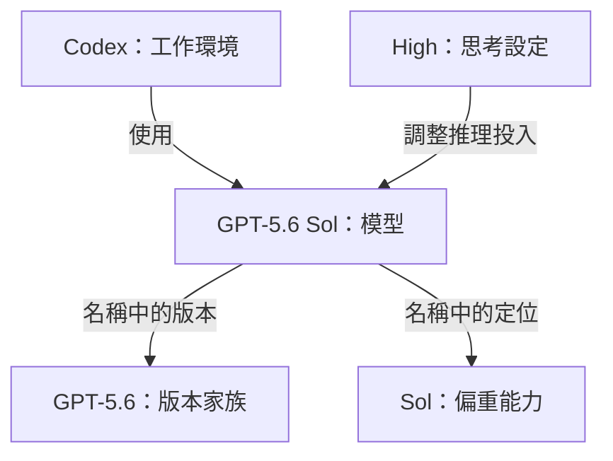

# Codex-name｜看懂 GPT 模型名稱

> **GPT 型號的共同邏輯：在不同技術版本下，提供不同的能力、速度與成本組合。**

寫給已經使用 Codex、想看懂模型選單的人。從共同邏輯出發，再把名稱放回對應的位置。

## 為什麼需要這麼多模型？

把模型想成「解題引擎」：理解輸入、做判斷，產生回答、程式碼或操作指令。

但「改一個按鈕顏色」與「找出整個系統部署失敗的原因」，需要的解題能力不同。模型的設計與選擇，因此圍繞同一個問題：**為了把工作做好，值得投入多少時間與運算成本？** [官方選擇原則][selection]

這讓模型名稱沿著兩個方向增加：

| 方向 | 代表什麼 | 例子 |
| --- | --- | --- |
| **版本更新** | 技術持續演進，推出新的版本家族 | GPT-5.5、GPT-5.6、GPT-6 |
| **定位分化** | 同一家族提供不同的能力與效率取捨 | GPT-5.6 的 Sol、Terra、Luna |

以 GPT-5.6 為例，[Sol][sol] 偏重複雜工作，[Terra][terra] 平衡能力與成本，[Luna][luna] 偏重低成本與大量任務。三者是不同模型；家族相同，定位不同。

版本更新也可能同時改善能力與效率。因此，比較模型時要一起看**版本與定位**，再用實際任務判斷適不適合。

## 用一個例子拆開名稱

**在 Codex 裡，選 GPT-5.6 Sol，將思考強度設為 High。**

這裡有三個可以分開理解的選擇：

- **工作環境**：透過 Codex 使用模型。
- **模型**：從 Sol 換成 Terra，是換一個解題引擎。
- **思考設定**：從 High 調成 Extra High，是調整同一模型的推理投入；可能改善複雜任務的結果，也通常需要更多時間與資源。[官方設定說明][models]

Codex 這個字還有另一種用法：在 **GPT-5.2-Codex** 中，它是模型名稱的一部分，表示針對程式開發工作做了優化。這與 Codex 作為工作工具的意思，需要分開理解。[模型定義][codex-model]

## 查名稱與演進

<strong>常見名稱對照：Sol、Terra、Luna、Astra、mini、nano、Spark、Pro</strong>

以下是代表性名稱的讀法；各代命名不完全一致，不能只靠字尾推算能力或內部架構。

| 名稱例子 | 名稱在表達什麼 |
| --- | --- |
| [GPT-5.6 Sol][sol] | 5.6 家族的旗艦定位，面向複雜工作 |
| [GPT-5.6 Terra][terra] | 5.6 家族中平衡能力與成本的定位 |
| [GPT-5.6 Luna][luna] | 5.6 家族中偏重成本與大量任務的定位 |
| [GPT-6 Astra][astra] | GPT-6 家族的模型，面向高難度、多步驟工作 |
| [GPT-5.4 mini][models] | 偏重效率，可用於快速程式任務 |
| [GPT-5.4 nano][nano] | 偏重低成本、大量且明確的任務，例如分類與資料擷取 |
| [GPT-5.2-Codex][codex-model] | 針對程式開發工作優化的模型 |
| [GPT-5.3-Codex-Spark][models] | 偏重低延遲、即時互動的程式開發模型 |
| [GPT-5.4 Pro][pro-model] | 投入更多運算處理難題的模型版本；名稱中的 Pro 與 ChatGPT Pro 訂閱方案需分開理解 |

mini／nano 與 Sol／Terra／Luna，都可以放在「能力與效率定位」這一層理解。官方將 Sol、Terra、Luna 的定位，分別約略對應到先前的主型號、mini、nano；這不代表跨代能力完全相同。[Sol][sol]、[Terra][terra]、[Luna][luna]

<strong>演進脈絡：從 GPT-5 系列到 GPT-6，名稱透露了什麼？</strong>

用幾個代表性變化，理解命名如何隨產品定位演進：

| 代表性型號 | 可觀察到的變化 |
| --- | --- |
| [GPT-5.2-Codex][codex-model] | 以 Codex 字尾標示程式開發特化 |
| [GPT-5.3-Codex-Spark][models] | 在程式開發方向上，再提供偏重即時速度的選擇 |
| [GPT-5.4][gpt54]、[GPT-5.5][gpt55] | 主模型也具備程式開發與專業工作能力，並可在 Codex 中使用 |
| [GPT-5.6 Sol][sol]／[Terra][terra]／[Luna][luna] | 同一家族以不同名稱標示能力與效率定位 |
| [GPT-6 Astra][astra] | 更新到 GPT-6 家族，延續面向複雜工作的方向 |

從這些例子可以看出：**能不能在 Codex 裡工作，要看模型能力與產品支援；模型名稱是否包含 Codex，只是命名的一部分。** [支援與選擇方式][models]

型號資訊核對於 **2026-09-12**。實際選項會依方案、登入方式與產品更新而不同，請以 [官方模型頁][models] 為準。

[selection]: https://developers.openai.com/api/docs/guides/model-selection
[models]: https://learn.chatgpt.com/docs/models?surface=app
[sol]: https://developers.openai.com/api/docs/models/gpt-5.6-sol
[terra]: https://developers.openai.com/api/docs/models/gpt-5.6-terra
[luna]: https://developers.openai.com/api/docs/models/gpt-5.6-luna
[astra]: https://developers.openai.com/api/docs/models/gpt-6-astra
[codex-model]: https://developers.openai.com/api/docs/models/gpt-5.2-codex
[gpt54]: https://developers.openai.com/api/docs/models/gpt-5.4
[gpt55]: https://developers.openai.com/api/docs/models/gpt-5.5
[nano]: https://developers.openai.com/api/docs/models/gpt-5.4-nano
[pro-model]: https://developers.openai.com/api/docs/models/gpt-5.4-pro
